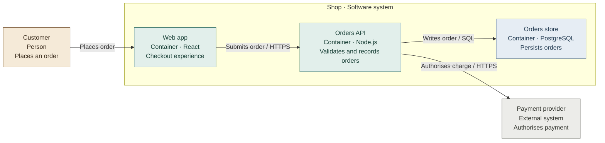

# C4 conventions

C4 models increasing detail: context → containers → components → code. Pick
levels that answer the reader's question. C4 is notation independent; these
reports use Mermaid flowcharts so Excalidraw can convert boxes and relationships
to native elements.

| View | Include | Boundary / avoid |
| --- | --- | --- |
| Context | People, the system in scope, external systems, purposes of interaction | One software system; no internal modules or frameworks |
| Containers | Applications, services, workers, data stores, protocols, technology | One system; a container is a runtime application or store, not necessarily Docker or a repo folder |
| Components | Cohesive responsibilities/interfaces inside one container; direct neighbouring dependencies | Name the parent container; do not mix internals of several containers at one level |
| Code | Selected types/functions and their relationships | Only if requested or needed; never dump every symbol |
| Dynamic | One scenario; numbered calls/events and their real direction | Supporting interaction view; label the scenario and abstractions used |

For an entire app, start with context and containers, then add components only
where useful. For a feature, orient the reader with its enclosing system or
containers, then explain the main scenario in an HTML event story and draw
component views per participating container where useful. Mermaid behaviour
diagrams supplement the story; they are optional. Shared infrastructure is outside a feature boundary unless
the feature owns it. Do not pretend a vertical feature spanning UI/API/worker is
one C4 component boundary.

For libraries or non-deployed codebases, describe the real consumers and package
responsibilities. State when a container level does not apply instead of
inventing a server. In monorepos, packages are not automatically containers.

## Evidence

- Docs express intent; entry points and config establish actual wiring. Reconcile
  differences and note stale or unverified docs.
- Imports establish code dependencies, not HTTP requests. Route registration plus
  a client call can establish a runtime edge; deployment config can establish a
  service boundary. Storage adapters/schema establish ownership only when traced
  to their consumer.
- Distinguish synchronous calls, asynchronous events, and compile-time contracts.
  Capture URLs and request/response contracts in the HTML chronology using
  [event conventions](flows.md). Sync describes a caller waiting for a reply;
  it does not mean a blocked browser or the absence of JavaScript promises.
  Describe a failing path only if it exists in code; do not infer retries, queues,
  caches, authentication, or third-party services from names alone.
- Every relationship needs evidence, or an explicit “inferred” note. Put evidence
  paths/ranges beside the view; no fabricated files, line numbers, or deployment
  claims. Report scope coverage and unknowns in the summary/notes.

## Mermaid subset

Use stable alphanumeric/underscore IDs and double-quoted labels. Escape literal
quotes using Mermaid entities (`#quot;`). Default to three short lines per node:
name, type / technology, responsibility in 3–7 words. Use ` ` line breaks.
Keep full source paths and qualifications in evidence/notes. Prefer 4–9 nodes;
split above 12 rather than reducing readability. These are Highvis defaults.
Avoid raw brackets in unquoted labels, HTML beyond breaks,
Markdown labels, nesting more than two boundaries, icons, remote resources,
init directives, and `click`. A database can be a typed rectangle; do not rely on
a cylinder shape surviving conversion.

This is illustrative, not a default architecture to paste into real reports.
Keep the four roles consistent across all views; type labels remain authoritative.
Mermaid `classDef` styles decorate entities, not abstraction levels.

## Review

Can a new reader name the system, scope, level, actors, owners, technologies, and
meaning of every arrow without opening the code? Are runtime and code dependencies
distinct? Are cross-boundary effects visible? Does every component view have one
parent container? Are unknowns marked? Split the view if the diagram cannot answer
these at a readable size.

Primary references: [C4 diagrams](https://c4model.com/diagrams),
[C4 notation](https://c4model.com/diagrams/notation),
[Mermaid-to-Excalidraw API](https://docs.excalidraw.com/docs/@excalidraw/mermaid-to-excalidraw/api),
[Excalidraw export utilities](https://docs.excalidraw.com/docs/@excalidraw/excalidraw/api/utils/export).
